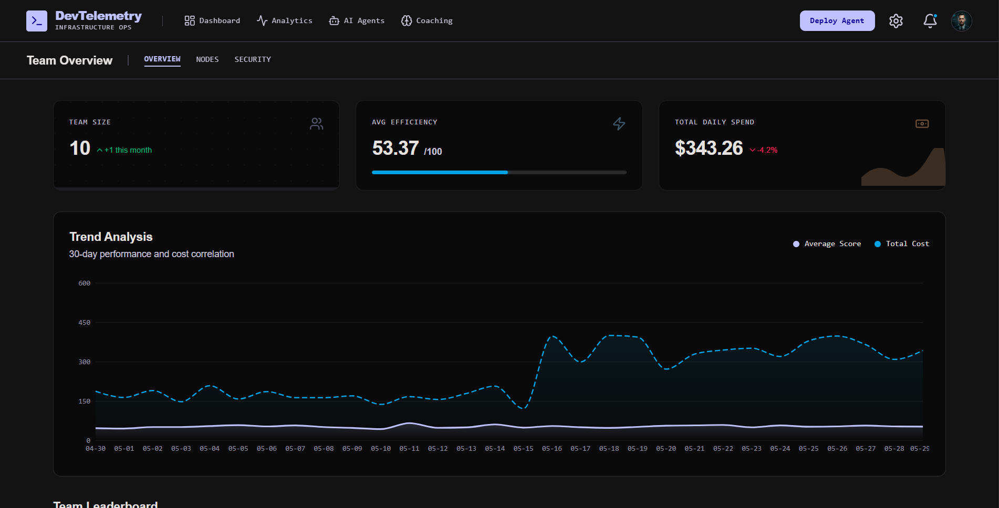
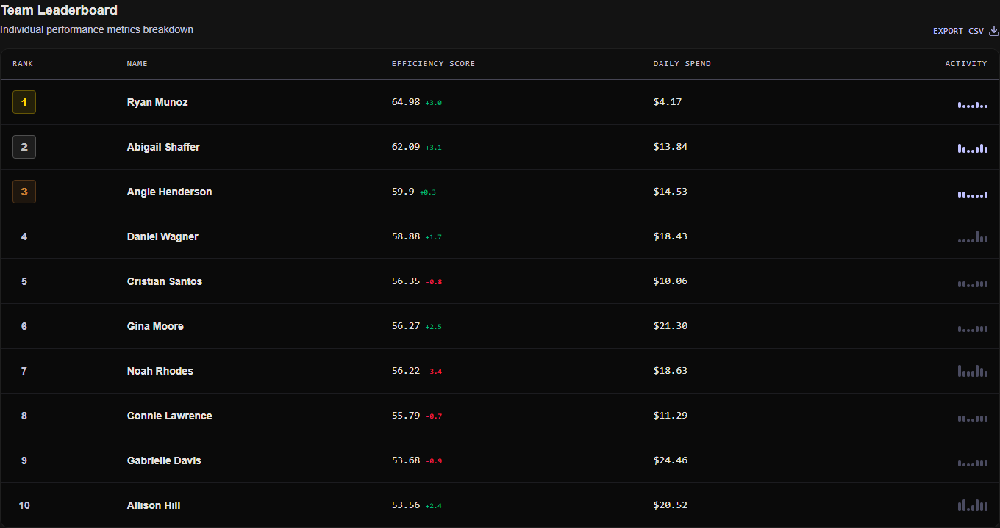
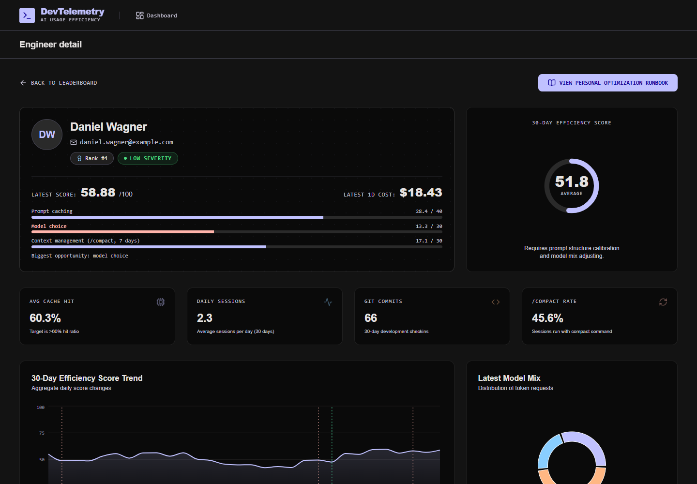
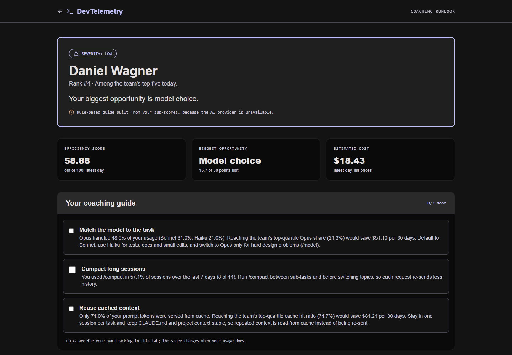
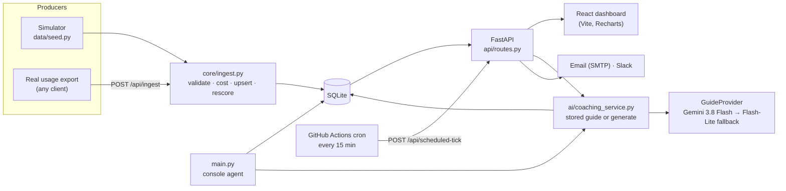

# DevTelemetry

> Scores how efficiently each engineer on a team uses AI coding tools (Claude Code), ranks the team, and writes each engineer a coaching guide grounded in their own numbers.


[](https://github.com/Priyanshh1407/DevTelemetry/actions/workflows/ci.yml)

🔗 **[Live demo → devtelemetry-1.onrender.com](https://devtelemetry-1.onrender.com/)** (Render free tier: the first load can take 30–60 s while it wakes up.)

> **The data is simulated.** Engineers are personas with stable habits plus daily noise, calibrated to Anthropic's published Claude Code cost (about $13 per developer per active day, under $30 for 90% of users). Real usage can be sent through the [ingestion API](#sending-real-usage-data); no real producer is connected in the demo.

---

## The problem

AI coding tools are billed per token, and most of the cost comes from habits:
- **Prompt caching:** re-sending the same context without it being served from cache.
- **Model choice:** using the most expensive model for simple work.
- **Context management:** letting the context grow instead of running `/compact`.

A manager sees only the total bill, and an engineer gets no feedback on their habits.

## What it does

1. **Takes in daily usage per engineer:** tokens split the way Anthropic's API reports them (uncached input, cache reads, cache writes, output), model mix, sessions and `/compact` uses. Data comes through a validated ingestion API; the simulator uses the same path.
2. **Computes cost** from a dated list-price table, and an **efficiency score from 0 to 100** that rewards habits, not low spend.
3. **Ranks the team** on a dashboard, with 30-day trends and a per-engineer score breakdown.
4. **Writes coaching guides** with Gemini: structured JSON, validated, citing only the engineer's real numbers and savings the code computed. If the model fails, a rule-based guide is built from the same numbers.
5. **Sends alerts** by email and Slack: on demand from the dashboard, or on a saved schedule triggered by GitHub Actions. The manager's memo is built from computed team facts and can only mention real Claude Code commands.
6. **Measures whether coaching works** with a difference-in-differences estimate, not a before/after that regression to the mean would fool ([docs/impact.md](docs/impact.md)).
7. **Shows what a habit costs:** a what-if calculator re-prices the engineer's real tokens at a better cache hit ratio or less Opus.
8. **Flags unusual spend** (a runaway agent loop, broken caching) against each engineer's own normal ([docs/anomalies.md](docs/anomalies.md)).

---

## Demo






Screenshots: local run of this repository, 2026-10-04, simulated team.

The console agent (`python main.py`) prints the latest leaderboard, a team memo, and guides for the bottom five. This is real output (2026-10-04, simulated team, trimmed):

```text
=================================================================
🏆 DEVTELEMETRY: EFFICIENCY LEADERBOARD — 2026-10-04
=================================================================
Rank  | Name                   | Score  | Spend ($)
-----------------------------------------------------------------
1     | Ryan Munoz             | 67.45  | $1.72
2     | Connie Lawrence        | 57.49  | $4.63
...
9     | Cristian Santos        | 49.62  | $2.13
10    | Angie Henderson        | 42.66  | $6.51

=================================================================
🚨 INDIVIDUAL COACHING GUIDES (BOTTOM 5)
=================================================================

--- Coaching for Angie Henderson (Rank: 10, Score: 42.66, Severity: critical) ---
1. Discipline is your weakest area, sitting 25.71 points below its maximum. You used /compact
   in only 14.3% of sessions over the last 7 days, which is just 2 of 14 sessions and earned
   4.29 of 30 points. Run the /compact command frequently in your sessions to keep your
   context window lean and improve your discipline score.
2. Only 57.7% of prompt tokens were served from cache, contributing 23.07 of 40 points ...
3. Your current model mix stands at Opus 22.0%, Sonnet 73.0%, and Haiku 5.0%, yielding
   15.3 of 30 points. Route simpler tasks to Haiku and Sonnet instead of overusing Opus ...
```

Every number in the guide comes from that engineer's data, and the first action is about their weakest area. The [evals](#ai-coaching-and-how-it-is-measured) check this automatically.

---

## Architecture



- **One write path.** Real and simulated data both go through `core/ingest.py`, so they get the same validation and the same cost and score.
- **Sync handlers.** Blocking work (SQLite, LLM calls) runs in FastAPI's threadpool, so one slow guide doesn't stall the dashboard. Measured: leaderboard latency while a guide waits 1.5 s on the LLM went from 1.32 s to 0.016 s.
- **Alert dispatch runs in the background.** `POST /api/trigger-alerts` answers 202 in 41 ms. A `dispatch_runs` ledger (single flight, enforced by the database) prevents double sends, and the dashboard polls its status.
- **The statistics live in `core/`, as pure functions.** `impact.py` (coaching effect), `anomaly.py` (spend anomalies) and `whatif.py` (re-pricing) take data in and return numbers. `analysis/` checks each one on simulated teams where the right answer is known.

---

## How the score works

| Part | Points | Measures |
|---|---|---|
| Cache | 40 | share of prompt tokens served from cache: `cache_read / (input + cache_read + cache_write)` |
| Model mix | 30 | weighted use of cheaper models (Haiku 1.0, Sonnet 0.6, Opus 0.1) |
| Discipline | 30 | `/compact` uses per session, **pooled over 7 days** |

The engineer page shows the points in each part and names the area that lost the most.

Two choices are measured, not assumed (simulation, 30 teams of 10):
- **Pooling `/compact` over 7 days.** One day's ratio was mostly luck. Pooling cut its day-to-day noise by two thirds, and the bottom two (who get "critical" alerts) now match the habitually worst engineers 82% of the time instead of 65%.
- **Weight sensitivity.** Moving any weight by ±20% keeps the ranking order very stable (Kendall τ 0.93–0.98), but in about 1 team in 10 it changes who is in the bottom two. So "critical" is a reason to talk, not a verdict.

Full rationale, field definitions and limitations: [docs/scoring.md](docs/scoring.md).

---

## AI coaching and how it is measured

**Pipeline** (`ai/`):
1. Only computed metrics go to the model, never names or emails (a test checks every prompt).
2. The prompt (v3) gives the model a block of facts and a block of savings computed by `core/whatif.py`. It asks for JSON matching a schema, and requires the guide to start with the weakest area and to quote no saving it computed itself.
3. The reply is validated with Pydantic. If it's invalid, one repair call feeds the error back. If that also fails, the engineer gets a rule-based guide built from their own sub-scores, marked as a fallback and never stored as a success.
4. Guides are stored in SQLite, keyed by data date, severity, prompt version and model, so repeat views cost nothing and a new prompt or model regenerates them.
5. **Model fallback:** if Gemini 3.8 Flash is out of quota (429) or overloaded (5xx), the request is retried once on Gemini 3.5 Flash-Lite. Free-tier quotas are per model, so the fallback has its own allowance. The main model is then skipped for 5 minutes.

**Evals** (`evals/`): 30 fixed engineer profiles, 10 per weakest area, across all severity tiers. Rule-based checks run on each guide: valid structure, every cited number found in the inputs (within rounding), first action on the weakest area, and the right number of actions.

Old prompt (v1, free text) vs the structured prompt (v2), both live on Gemini 3.5 Flash-Lite, same 30 profiles:

| | v1 | v2 |
|---|---|---|
| Valid guide | 100% | 100% |
| **First action targets the weakest area** | **50%** | **100%** |
| Guides with no ungrounded number | 80% | 100% |
| Cited numbers grounded | 97.4% of 267 | 100% of 442 |
| Latency p50 / p95 | 1.8 / 2.7 s | 2.1 / 2.8 s |

- **The main gain is targeting.** v1 talks about caching to people whose problem is model choice.
- **v1 rarely invents numbers.** Reviewing each of its flagged numbers by hand found one wrong figure in 30 guides.
- **Results depend on the model.** On 3.8 Flash, v1 already targeted 100% (10 profiles). That's why each eval run uses a single model.
- **Prompt v3 adds computed savings without losing anything.** Same model, same 30 profiles:
  - validity, targeting and grounding stay at 100% (all 552 numbers grounded);
  - 29 of 30 guides quote a real saving, e.g. "Raise your cache hit ratio to the team top quartile of 83.0% to save $346.91 per 30 days";
  - the cost is one first-try failure (fixed by the repair) and about 12% more tokens.
- **Free to reproduce.** Replies are recorded, so `python -m evals.run --pipeline v3` re-scores them without API calls. CI checks that the recordings still reproduce the published tables ([v1](evals/results/gemini-3.5-flash-lite/v1.md), [v2](evals/results/gemini-3.5-flash-lite/v2.md), [v3](evals/results/gemini-3.5-flash-lite/v3.md)).

**Team memo** (`ai/team_memo.py`): the manager's digest memo is built from computed team facts: points lost per area, weakest-area counts, critical tier and recent spend anomalies. The reply is validated against a schema and against [Claude Code's documented commands](https://code.claude.com/docs/en/commands). A memo that names a command or `.claude…` file that doesn't exist is repaired once, then replaced by a rule-based memo.

Old free-text memo vs the grounded one, 15 simulated team-days, Gemini 3.5 Flash-Lite ([team-v1](evals/results/gemini-3.5-flash-lite/team-v1.md), [team-v2](evals/results/gemini-3.5-flash-lite/team-v2.md)):

| | Old memo | Grounded memo |
|---|---|---|
| Valid | 100% | 100% |
| **Main recommendation targets the team's biggest gap** | **0%** | **100%** |
| Numbers cited (all grounded) | 33 | 195 |
| Invented commands or files | 0 | 0 |

The old memo gave generic advice because it never saw per-area data. Neither memo invented a command in this run; the guard is a safety net for the time one did (`.claudedir`, Phase 7).

**Metering** (`GET /api/ai-stats`): every request records outcome, tokens (from the provider's usage data), latency, cost, model and prompt version. From two `main.py` runs on a fresh database:
- $0.0010 per generated guide;
- 50% cache hit rate (the second run served all five guides from the database);
- 0% fallback rate;
- p50 / p95 latency 2.1 / 5.3 s.

---

## Measured features

Each of these comes with a script that checks it on simulated data where the right answer is known.

### Did the coaching work? (`GET /api/coaching-impact`)

Coaching goes to the bottom two by that day's score. Anyone picked on a bad day looks better the week after, coached or not (regression to the mean). So "after minus the coaching day" says coaching works even when it does nothing.

DevTelemetry instead compares the coached area's points over:
- **before:** days −13 to −7, which skips the days the selection depended on;
- **after:** days +1 to +7.

It then subtracts the same change for engineers who weren't coached (**difference-in-differences**), with a cluster-bootstrap 95% interval.

`python -m analysis.coaching_impact`: 200 simulated teams, where every coached day is regenerated without the coaching to get the true effect:

| True effect | Naive (after − coaching day) | Difference-in-differences | Its 95% CI covers the truth |
|---|---|---|---|
| none (0.00) | +0.82, "it worked" in 18% of teams | **+0.02** | 98% |
| moderate (+4.13 points) | +5.74 | **+4.13** | 98% |

On the demo data (simulated coaching with a real effect), the dashboard card shows **+3.0 points (95% CI +1.6 to +4.5)**. Details and limits, starting with the parallel-trends assumption: [docs/impact.md](docs/impact.md).

### What would a better habit save? (`GET /api/engineer/{id}/what-if`)

The engineer page has two sliders: target cache hit ratio and maximum Opus share. They start at the team's top-quartile habits. The API re-prices the engineer's actual last 30 days of tokens with the same price table as the bill, and returns the saving per 30 days for each lever and both together.
- **Property tests:** a better habit never costs more, and no change reproduces the bill.
- **Same numbers in the guides:** prompt v3 and the rule-based guide quote these savings.

### Unusual spend (`GET /api/anomalies`)

A day is flagged when it costs far more than that engineer's previous 28 days of the **same day type** (weekdays vs weekends): median/MAD robust z ≥ 3.5 and at least $5 above normal. The likely cause (more tokens, broken caching or more Opus) is found by re-pricing the day at the usual habit.

`python -m analysis.anomaly_eval`: 6,170 injected incidents in 200 simulated teams:

| Detector | F1 | Recall | False alarms per engineer-month | Weekend recall |
|---|---|---|---|---|
| **Own normal, median/MAD** | **0.69** | 72% | 0.37 | 57% |
| Fixed $30/day | 0.36 | 36% | 0.63 | 7% |
| Mean + 3σ (same windows) | 0.66 | 61% | 0.23 | 53% |

It catches 91% of runaway loops but only 51% of broken caching: for an engineer whose hit ratio was already low, the change is only a few dollars. Anomalies appear on the dashboard, on the engineer chart and in the manager digest. More in [docs/anomalies.md](docs/anomalies.md).

---

## Sending real usage data

`POST /api/ingest` (admin token in `X-Admin-Token`) accepts up to 1,000 records per request, one per engineer per day. Field names follow Anthropic's `usage` object (`input_tokens` = uncached; see [docs/scoring.md](docs/scoring.md)):

```json
{"records": [{"user_id": "ada", "date": "2026-10-03", "name": "Ada Lovelace", "email": "ada@example.com",
  "input_tokens": 400000, "output_tokens": 30000, "cache_read_tokens": 2500000, "cache_write_tokens": 150000,
  "opus_pct": 0.2, "sonnet_pct": 0.6, "haiku_pct": 0.2, "session_count": 4, "compact_uses": 2, "git_commits": 3}]}
```

- **Idempotent:** resending a day updates it instead of duplicating it, and the engineer's scores are recomputed, because the `/compact` term pools 7 days.
- **Validated per record:** these are rejected:
  - negative counts;
  - model shares that don't sum to 1;
  - `compact_uses > session_count`;
  - future dates;
  - unknown fields;
  - client-supplied cost or score.

  The response lists each rejected record by index, with reasons; the rest are still written.
- **Server-side cost:** computed from the dated price table in `core/pricing.py`; each row records which version was used (`cost_price_version`).
- **New engineers:** `name` and `email` are required the first time an engineer appears.
- **Measured:** 10,000 records in 0.66 s on SQLite.

---

## API

| Method | Path | Notes |
|---|---|---|
| GET | `/health` | Database reachable, scoring version, latest data date, whether AI is configured |
| GET | `/api/leaderboard` | Latest day, ranked, with 7-day trend |
| GET | `/api/trends` | Team averages, last 30 days |
| GET | `/api/engineer/{id}/details` | History, rank, severity, score breakdown, coaching days, spend anomalies |
| GET | `/api/engineer/{id}/what-if?cache_hit=&opus_pct=` | Monthly saving at a target habit (default: team top quartile) |
| GET | `/api/coaching-impact?days=120` | Coaching events with naive, before/after and difference-in-differences estimates |
| GET | `/api/anomalies?days=14` | Days far above that engineer's usual spend, with the likely driver |
| GET | `/api/guide/{id}`, `/api/runbook-tasks/{severity}/{id}` | Coaching guide (stored or generated) |
| GET | `/api/ai-stats` | Metering summary |
| GET | `/api/settings`, `/api/dispatch-runs/{id}` | Alert schedule, dispatch status |
| POST | `/api/settings`, `/api/trigger-alerts`, `/api/scheduled-tick`, `/api/ingest` | **Admin token required** |

Interactive docs at `http://localhost:8000/docs`.

---

## Getting started

Needs Python 3.13+ and Node 22+. A Gemini API key is optional: without one, guides use the rule-based fallback.

```bash
git clone https://github.com/Priyanshh1407/DevTelemetry.git
cd DevTelemetry

# Backend (terminal 1)
python -m venv venv
source venv/bin/activate              # Windows: venv\Scripts\activate
pip install -r requirements.txt
cp .env.example .env                  # optional: set GEMINI_API_KEY; set ADMIN_TOKEN for admin actions
python data/seed.py                   # 120 days x 10 simulated engineers (deterministic)
uvicorn api.main:app --reload         # API on http://localhost:8000

# Dashboard (terminal 2)
cd frontend
npm ci
npm run dev                           # http://localhost:5173
```

Optional:
- **Console agent:** `python main.py`.
- **Reset the data:** `python data/seed.py --reset`.
- **Demo data options:**
  - `--coaching-effect none|small|moderate|off`: the true effect of simulated coaching every 14 days (default `moderate`);
  - `--incidents N`: incident days injected in the last 14 days (default 3).

### With Docker

```bash
docker compose up --build             # dashboard http://localhost:5173, API http://localhost:8000
```

The backend seeds an empty database on start and keeps it on a named volume.

### Configuration (`.env`)

| Variable | Purpose |
|---|---|
| `GEMINI_API_KEY` | AI guides and team memo (free key: [aistudio.google.com](https://aistudio.google.com)) |
| `GEMINI_MODEL`, `GEMINI_FALLBACK_MODEL` | Default `gemini-3.8-flash`, fallback `gemini-3.5-flash-lite` (empty = no fallback) |
| `ADMIN_TOKEN` | Required for admin actions; unset = they answer 503. The dashboard asks for it once per tab. |
| `EMAIL_SENDER`, `EMAIL_PASSWORD`, `EMAIL_RECIPIENT`, `SLACK_WEBHOOK_URL` | Alert delivery (optional) |
| `PRODUCTION_MODE` | `false` (default) sends every email to `EMAIL_RECIPIENT` |
| `FRONTEND_URL` | Dashboard origin allowed by CORS and used in links |
| `VITE_API_URL` | Frontend build: the API's URL (default `http://127.0.0.1:8000`) |

### Tests

```bash
pip install -r requirements-dev.txt
pytest                                # backend
python -m evals.run --pipeline v3     # re-score the recorded guide eval (no API calls)
python -m evals.team_run --pipeline team-v2   # same for the team memo
python -m analysis.coaching_impact    # validation tables (about 1 minute each)
python -m analysis.anomaly_eval
cd frontend && npm test && npm run lint
```

- **Coverage:** 434 backend tests at 97.6% coverage, plus 45 frontend tests.
- **Offline by design:** the test suite blocks network access and never touches `data/usage.db`.

---

## GitHub Actions (CI and scheduled alerts)

Two workflows live in `.github/workflows/`:

| Workflow | Runs when | What it does |
|---|---|---|
| **CI** (`ci.yml`) | every push and pull request | Backend: ruff + pytest (Python 3.13 and 3.14, coverage must stay ≥ 85%). Frontend: ESLint + Vitest + production build. Needs no secrets. |
| **Scheduled alerts tick** (`scheduled-alerts.yml`) | every 15 minutes (only from the default branch) | Calls `POST /api/scheduled-tick`; the API sends the saved alert schedule at most once per slot. Needs the repository secrets `DEVTELEMETRY_API_URL` and `DEVTELEMETRY_ADMIN_TOKEN`. |

### Turning GitHub Actions off

| How | Stops | Manual "Run workflow" |
|---|---|---|
| **Repository variable** (soft switch): Settings → Secrets and variables → Actions → **Variables** → set `CI_ENABLED` or `SCHEDULED_ALERTS_ENABLED` to exactly `false`. Delete it (or set `true`) to turn it back on. | Automatic runs of that workflow (they show as *skipped*) | Still works |
| **Disable button** (hard switch): Actions tab → pick the workflow → `...` → **Disable workflow** (**Enable workflow** to undo). Everything: Settings → Actions → General → **Disable actions**. | All runs of that workflow (or all workflows) | Blocked |
| **One push only:** put `[skip ci]` in the commit message. | CI for that push | n/a |

From a terminal with the GitHub CLI:

```bash
gh variable set SCHEDULED_ALERTS_ENABLED --body false   # soft off
gh variable delete SCHEDULED_ALERTS_ENABLED             # back on (unset = on)
gh workflow disable "CI"                                # hard off
gh workflow enable "CI"
```

Notes: the value must be exactly `false` (other spellings count as on). If CI is a *required* check for merging, GitHub treats skipped jobs as passing, so only switch CI off temporarily. `tests/test_workflows.py` fails if any workflow job is missing its switch.

---

## Known limitations

- **Simulated data.** The demo has no real producer. The ingestion API is the contract a real one would use.
- **Daily aggregates.** Cost is split across models by usage share, not per request.
- **The model mix ignores task difficulty.** Using Opus for a hard design problem scores the same as using it for a typo.
- **Goodhart's law.** Once `/compact` is scored it can be gamed. Treat the score as a conversation starter.
- **Eval coverage.** Rule-based checks measure structure, grounded numbers, targeting and real commands, not whether the advice is right. One grounded memo said `/compact` improves caching, which is wrong; catching that needs human review or an LLM judge.
- **Coaching impact assumes parallel trends.** Difference-in-differences assumes coached and uncoached engineers would have moved alike without the coaching. A random holdout would be stronger. The method is validated on simulation, and the demo's coaching effect is simulated.
- **Anomalies are single days.** A slow leak over a week, or broken caching for someone who barely used the cache, can stay under the threshold.
- **Auth is a shared admin token.** There are no user accounts or roles.
- **SQLite is a single writer.** That's fine at team scale; many teams writing at once would call for Postgres.
- **Free-tier hosting.** On Render's free tier the database is reset on each deploy, and the first request after idling is slow.

---

## Project structure

```text
ai/              coaching and team memo: provider + fallback model, prompts, schemas, rule-based fallbacks, Claude Code command list, storage, metering
analysis/        validations on simulated teams: weight sensitivity, coaching impact, anomaly detection
api/             FastAPI app, routes, admin-token check
core/            scoring, pricing, ingestion, severity tiers, coaching impact, anomalies, what-if, dispatch, DB
data/            schema, simulator, alert worker
docs/            scoring.md, impact.md, anomalies.md
evals/           guide and team-memo eval sets, checks, runners, recorded replies and results
frontend/        React 19 + Vite + Tailwind + Recharts dashboard (Vitest tests)
notifications/   email (Jinja2 templates) and Slack
tests/           pytest suite (network blocked, mocked Gemini, temporary databases)
main.py          console agent
```

The engineering history lives in [FIX_LOG.md](FIX_LOG.md): what was wrong, how it was found, and what was measured before and after. [PROJECT_AUDIT_REPORT.md](PROJECT_AUDIT_REPORT.md) is the audit that started it.

---

## Licence

No open-source licence is granted: all rights reserved. You're welcome to read the code and run it locally to evaluate it.

---

*Built by Priyansh Waghela · [LinkedIn](https://www.linkedin.com/in/priyansh-waghela-3b754b282/)*
